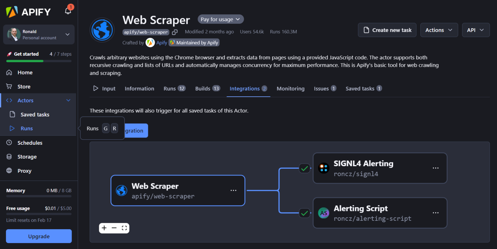
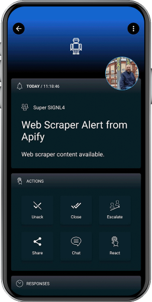

# SIGNL4 Integration with Apify

The SIGNL4 integration is available as an [Actor](https://apify.com/roncz/signl4) in Apify.

Sending automated alerts from Apify has several benefits. Users can react to critical situations quickly and to take according action. Here come some sample use cases:

- Alerts on certain Actor states, e.g. failures
- Web scraping alerts, e.g. if a web page changes or if a certain value or price reaches a threshold
- Use Robotic Process Automation (RPA) to monitor your web workflows and alert admins if a workflow fails (before your customers will recognize)
- Integrate with other tools including AI (ChatGPT, LLMs) to create powerful alerting workflows

SIGNL4 is a mobile alert notification app for powerful alerting, alert management and mobile assignment of work items. Get the app at [https://www.signl4.com](https://www.signl4.com/).

## Prerequisites
- A [SIGNL4](https://www.signl4.com/) account
- An account at [Apify](https://apify.com/)

To run the actor in Apify simply create a new task for the actor by clicking the green button above, modify the actor input configuration, click Run and get your results.



## Send Alerts
You can trigger an alert using a webhook from another Actor, e.g. when the Actor reaches a certain state. You obtain the webhook URL of the SIGNL4 Actor at API -> API endpoints. The Payload template might look like follows:


```json
{
    "userId": {{userId}},
    "createdAt": {{createdAt}},
    "eventType": {{eventType}},
    "eventData": {{eventData}},
    "resource": {{resource}},
    "secret": "your-signl4-team-or-integration-secret",
    "title": "Web Scraper Alert from Apify",
    "data": {{eventData}}
}
```


Alternatively, you can trigger the alert within the code of another Actor like this:

```javascript
import { Actor } from 'apify';
await Actor.init();

// Send SIGNL4 alert
await Actor.call('roncz/signl4', {
    secret: 'your-signl4-team-or-integration-secret',
    title: 'Web Scraper Alert from Apify',
    message: "Web scraper content available.",
    data: headingObject
});

await Actor.exit();
```

You can find more information at [https://apify.com/roncz/signl4](https://apify.com/roncz/signl4).

The alert in SIGNL4 might look like this.


