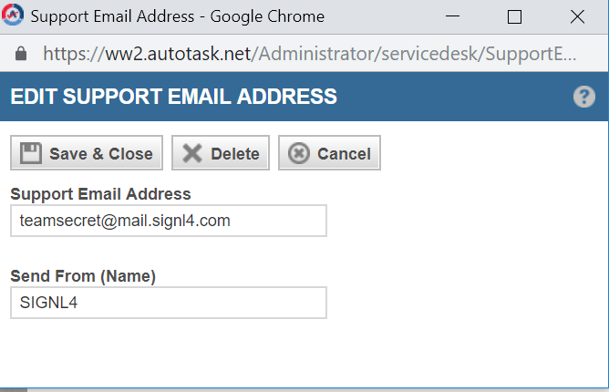
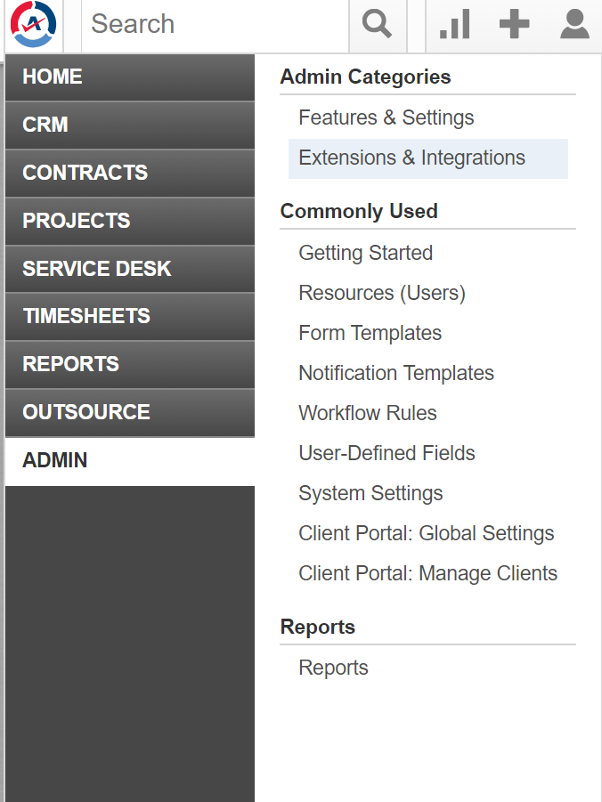
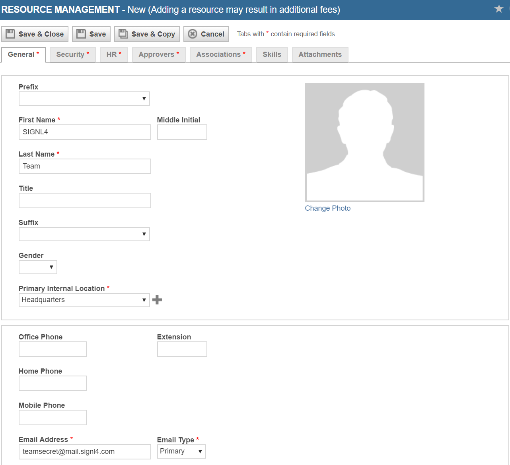
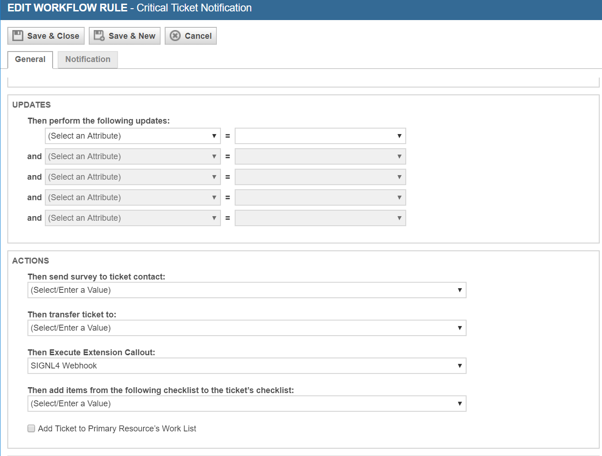

# SIGNL4 Integration with Autotask

You can configure the Autotask integration with SIGNL4 as follows.

## Connector App (Two-Way)

This is the recommended approach offering two-way integration of SIGNL4 with Datto (Kaseya) Autotask.

The Autotask connector app makes 2-way integration with Autotask a child's play and responding to service desk tickets can be done conveniently via the SIGNL4 mobile app.

Feature overview
- Forwarding tickets of your choice to SIGNL4
- Status synchronization between both systems
- Agent assignment when Signl is acknowledged and or closed
- Ticket notes on status changes in SIGNL4

How does it work?
The connector communicates using the Autotask REST API to read ticket details or to update them. An API user with according permissions must be used and created in Autotask.

You can install and configure the integration in the SIGNL4 web portal under Integrations -> Gallery -> Autotask (please make sure to select the two-way integration here <- / -> ).

Here you need to configure your Autotask API username and secret with sufficient access rights. You can find more information [here](https://www.autotask.net/help/Content/4_Admin/1CompanySettings_Users/ResourcesUsersHR/Resources/API_User_Add_Edit.htm). The other parameters are optional, and you can find more information when hovering over the (?) symbol of the according item.

## Simple Email Integration

Using the email integration you can forward any ticket to your SIGNL4 team for a quick response and resolution to an open issue.

Open the ticket and click on the Forward icon at the top.

Select the Notification tab.

Input the SIGNL4 team email address in the other Email(s) section.

Click Save & Close.

## Simple Webhook Integration

Configuring a webhook URL and assigning it to a Workflow will ensure automatic delivery of ticket information to your SIGNL4 team.

From the Admin Menu select Extension and Integrations.

Select Other Extensions and Tools.

Click on Extension Callout (Tickets).

Add New Extension Callout.

From the GENERAL TAB:
- Give it a name
- Insert the SIGNL4 webhook URL

HTTP Method should be set to POST:
- Data Format should be XML
- Click Save and Close

**Editing WorkFlow Rules** 

From the Admin Menu select Workflow Rules.

Edit the rule that you wish to go out for alerting (such as Critical Ticket Notification).

Under Actions Select the drop down menu in Then Execute Extension Callout.

Select SIGNL4 Webhook.

Click Save.

