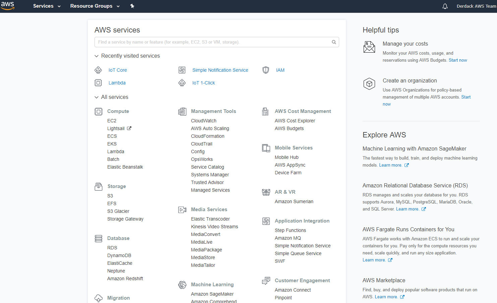
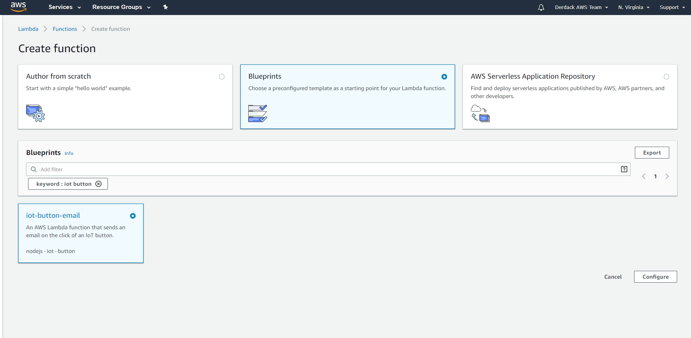
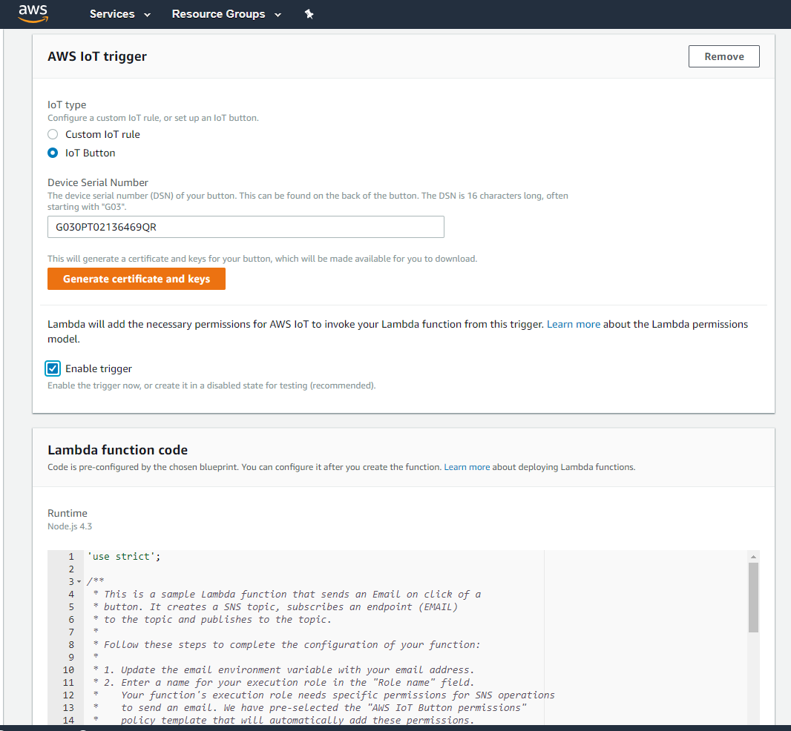
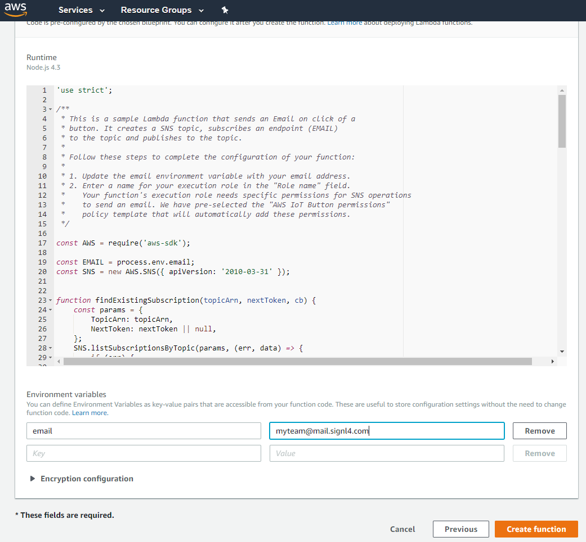
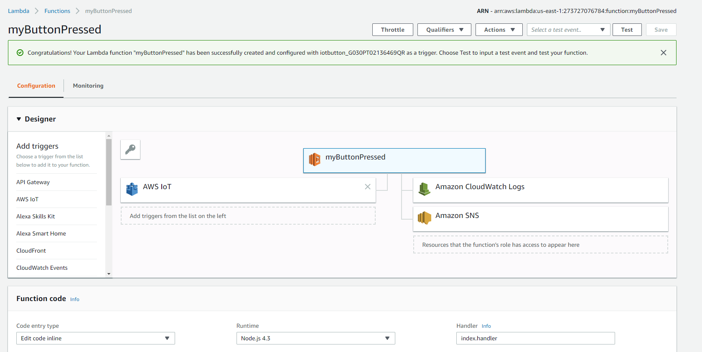
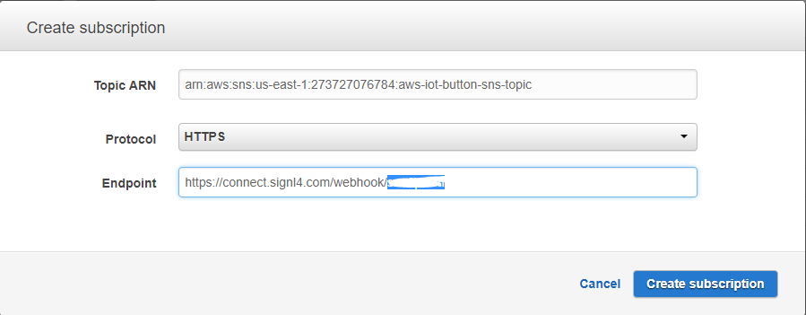
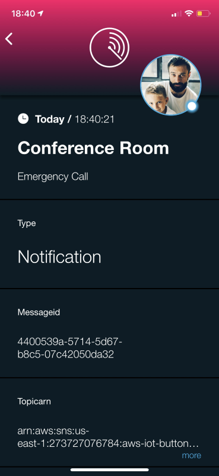
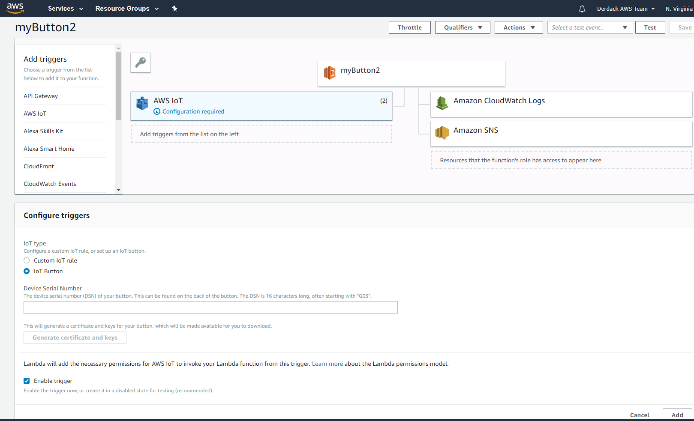
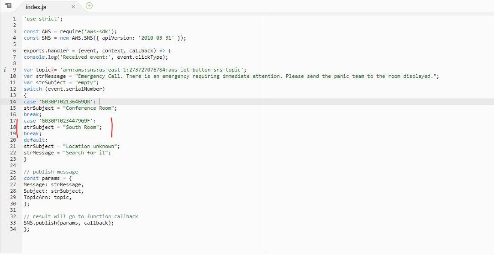

# SIGNL4 Integration with AWS IoT Button

The [AWS IoT Button](https://aws.amazon.com/iotbutton/) is a useful tool for daily operations on the shop floor or in the field. Set a custom command to be triggered when the button is pressed, and integrate it with your SIGNL4 team to get immediate, actionable alerts when disaster strikes.

The AWS IoT Button is a great IoT device. A simple press of a button turns into unlimited possibilities. And with SIGNL4 you can easily trigger mobile alerts to operations or security teams. Almost in real-time.

## What is the AWS IoT Button?

The AWS IoT Button is the ‘unlinked’ version of the Amazon Dash Button invented to let you order stuff from Amazon with a single touch of a button (e.g. diapers or food). It comes with WIFI connectivity and a serial number which is used to identify it once it is pressed. It connects to [AWS IoT](https://aws.amazon.com/products/) and can call a Lambda function which then can execute code. Read more on the [AWS IoT Button here](https://aws.amazon.com/iotbutton/getting-started/).

_However, I have to admit that onboarding the IoT Button and getting it connect to your business processes (including SIGNL4) is quite a tricky thing to do. And the process is somewhat cumbersome and hold a couple of pitfalls. That is why I aim to ease it a bit by explaining what you have to do._

## Step 1: Creating the Lamdba function

First of all you need an AWS account which might incur some charges. You can [register on AWS here](https://aws.amazon.com/). Once you are registed, go to the [AWS console](https://console.aws.amazon.com/console/home) which should look somewhat like this:



From the AWS console, under "Compute" choose "Lambda". Then, when you see the list of functions, click "Create Function" on the top right. Select "Blueprints" and search for "iot button". There should be one template called "iot-button-email". Select it and click "Configure".



Next, give your function a name and set a role name.


Next, choose "IoT Button" as IoT type and enter the device serial number you find on the back of your button.

PS: You can generate the certificates and keys for your button also here. So, Step 1 from above can be left out.



Click "Generate certificate and keys" and download both the certificate and the private key to your computer. You will need it to configure your button later.

Enter the proper email adress under “Environment variables”. Use the dedicated email adress of your SIGNL4 team. It should a cryptic 8-letter/number code followed by ‘mail.signl4.com’. You find this email address in the SIGNL4 account management portal or in your mobile app.



Click “Create function”. Your Lambda function is almost ready.



Creating the Lambda function has also created a rule for your IoT devices, i.e. the button. This rule is the trigger for the Lambda function when your button sends an event.

So, now we have a Lmbda function that sends an email to SIGNL4, resulting in a mobile alert. But, we now need to tailor the message.

## Step2: Real-world button setup

In order to setup the button, we need to connect it to your local WIFI and put the certificates and the endpoint information onto the button.

The AWS IoT Button can create its own hotspot, so this is pretty convenient. Before you start, make sure that:

1. You have the access details to the WIFI, the button shall connect to later
2. You have the AWS endpoint the button shall connect to
3. You have the certificat and private key stored on the device you are going to use to configure the button

As for 2), you find the endpoint information the configuration of the ditigal twin. It looks like this:


And now, go and configure the button. Here is a perfect description of what to do: [https://docs.aws.amazon.com/iot/latest/developerguide/configure-iot.html](https://docs.aws.amazon.com/iot/latest/developerguide/configure-iot.html) 


Once the AWS IoT Button is properly configured, it is going to create events in AWS IoT.

_If you have any trouble connecting the button, here is the trouble-shooting guide from Amazon: [https://aws.amazon.com/iotbutton/faq/](https://aws.amazon.com/iotbutton/faq/)_

When you now press the button, it will first blink in white, then in green. This means it successfully connected and submitted an event. Your Lambda function will trigger and submit an email via Amazon SNS (Simple Notification Services). This email will be sent to the email you entered. At first, AWS will send you a subscription confirmation message due to regulatory reasons. Press the button once to execute the Lambda function and have it create the SNS (Simple Notification Service) topic. It will create an alert in SIGNL4 but you can ignore it because we are going to switch to the SIGNL4 webhook and not use email.

## Step 4: Switching to webhooks and improving the alert message

Using SNS and email works but there is room for improvement. That is why we need to switch to using the webhook of SIGNL4. First of all, we need to alter the Lambda function. Please, replace your Lambda function code with the following (only if you pressed the button once as this create the SNS topic!):

```javascript
'use strict';

const AWS = require('aws-sdk');
const SNS = new AWS.SNS({ apiVersion: '2010-03-31' });

exports.handler = (event, context, callback) => {  
  console.log(‘Received event:’, event.clickType);
  
  var topic_ _\= 'YOUR TOPIC ARN'; 
  var strMessage = "Emergency Call";
  var strSubject = "empty"; 
  switch (event.serialNumber)
  {  
    case 'YOUR BUTTON ID':
    strSubject = "Conference Room";  
    break;
    default:
    strSubject = "Location unknown";
    strMessage = "Search for it";
  }
  
  // publish message
  const params = {
    Message: strMessage,
    Subject: strSubject,
    TopicArn: topic,
  };
  
  // result will go to function callback
  SNS.publish(params, callback);
};
```

There are two parameters you need to add. First, the ID of your button in the case statement. The button ID is on the back of your IoT button. So, if for instance your button is in the conference room, replace YOUR BUTTON ID above with the your button id. If you have more than one button triggering this Lambda function, replicate the case statement. You can also add the strMessage variable to each case statement. This creates a dedicated message and subject for each button.

You also need to change “YOUR TOPIC ARN” and copy the ARN of the SNS topic here. See below, in my case it is "arn:aws:sns:us-east-1:273727076784:aws-iot-button-sns-topic".

Next, we need to add a webhook subscription to our SNS topic. Select the topic that was created by your Lambda function. Click “Actions” and then “Subscribe to a topic”. Select “HTTPS” and the enter ‘https://connect.signl4.com/webhook/TEAMSECRET’ where TEAMSECRET is the unique team id you can find in the SIGNL account management portal. It is a 8-digit/letter combination.

[[SNS Topic](snstopic.png)

Click “Create Subscription”.



AWS SNS will now call the webhook and request a confirmation. SIGNL4 will turn this confirmation request into an alert which looks like this:


Click the blue link under “Subscribeurl”. SIGNL4 opens the mobile browser and the SNS subscription is confirmed. It is important to do this, otherwise AWS will not call the webhook.

Now, whenever you press your IoT button, you create an alert in SIGNL4. Well done!



## Step 5: Adding more buttons

Rarely, there is going to be just one button. So, we need to add more AWS IoT buttons to our environment. This requires 2 steps.

First, we need to add additional buttons to be triggers of our Lambda function. Go to the AWS Console, then to “Lambda” and select the function we created. Click on “AWS IoT” under “Add triggers”. In the box below, set Type to “IoT Button” and enter the serial number of the next AWS IoT Button. If you have not registered your button alreasy, you can generate the required certificates here. Use them when connecting the new button to your WIFI as described in step 2. You need to repeat this including step 2 for every button you add. Click add to finish. Now, your second button triggers the Lambda function.



The only thing left now is to alter the alert text for the button. We do this by adding a code sniplet to the Lambda function. Click on the tile with the function name. This opens the code. Add a case statement set contains the button id as well as the text for the subject of the alert message. The picture below shows it. In our example, the subject text equasl the room name so that the person receiving the alert nows where it was triggered. Click “Save” on the top right to save the new code version.



Now, the new buttons raises an alert in SIGNL4 as well. And this is how it looks. It now displays a different room depending on which button is pressed.

## Anything else?

Well, once you have the buttons raising an alert with SIGNL4 you can now go ahead and customize your alerting experience. With SIGNL4 you can create a dedicated visual experience, use multiple alert notifications channels including push, text and voice and track responses. Explore SIGNL4 to learn how modern alerting can look like!

Also, see the video below.

<iframe title="Mobile maintenance call on the shop floor" src="https://player.vimeo.com/video/242933548?h=eb6de0a430&amp;dnt=1&amp;app_id=122963" width="560" height="315" frameborder="0" allow="autoplay; fullscreen; picture-in-picture" allowfullscreen></iframe>

The alert in SIGNL4 might look like this.


