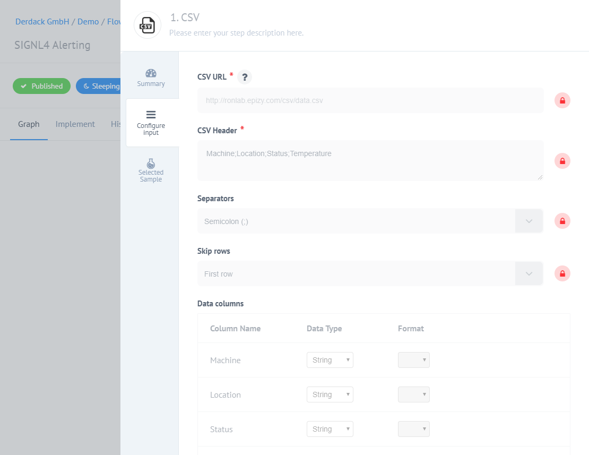
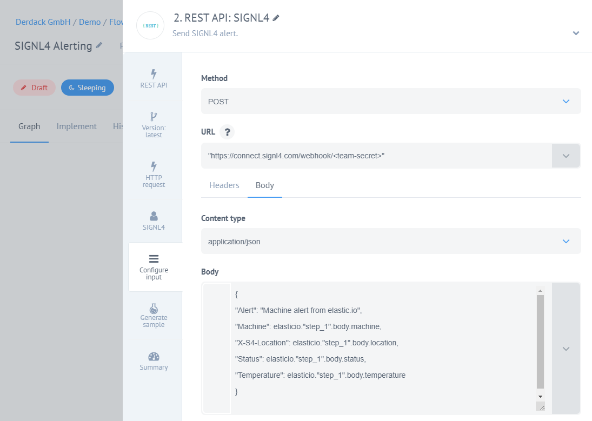

# SIGNL4 Integration with elastic.io

[elastic.io](https://www.elastic.io/) is a hybrid integration platform that comes with a rich library of pre-built connectors for mainstream business applications. It can reduce your own integration efforts significantly. Pairing this powerful platform with SIGNL4 can enhance your daily operations with an extension to your team wherever it is.


In our example we will read a .csv file from a web server and send the data as an alert to our SIGNL4 team.

SIGNL4 is a mobile alert notification app for powerful alerting, alert management and mobile assignment of work items. Get the app at [https://www.signl4.com](https://www.signl4.com/).

## Prerequisites

- A SIGNL4 ([https://www.signl4.com](https://www.signl4.com/)) account
- An elastic.io ([https://app.elastic.io](https://app.elastic.io/)) account

An web server for testing (optional)

## Logon to elastic.io

Log on to the elastic.io platform at [https://app.elastic.io](https://app.elastic.io/) and go to Flows.

## Create the Flow

Now you can create a new flow consisting of three steps:

1. CSV Connector: Reads the .csv file from a web server in certain intervals. You define your URL here.  
2. Filter: This is optional and we just check for certain conditions (temperature too high) here.  
3. REST API: Here we send the HTTP POST request to SIGNL4 in order to trigger the alert.


## CSV Connector

Here we read a .csv file from a web server.

The format of our .csv file is the following.

```
Machine;Location;Status;Temperature
Heater A2;52.3995023,13.0584155;OK;4
Heater A1;52.3995023,13.0584155;Error;44
```



## Filter

In this optional step we check is the temperature is higher than a certain value. Only in this case the flow will continue.


## Configure the REST API

We send an HTTP Push request to SIGNL4 in order to trigger an alert. The URL is your SIGNL4 webhook URL including your team secret. The content-type is application/json and the Body is the JSON payload. In our case we take the content of the .csv file from our web server.



For testing you can create a .csv file with the above content and put it onto your web server. Then the Flow will read the file and send the content to SIGNL4. Your SIGNL4 team will get the alert.

You can find a sample in GitHub:  
[https://github.com/signl4/signl4-integration-elastic-io](https://github.com/signl4/signl4-integration-elastic-io)


The alert in SIGNL4 might look like this.


