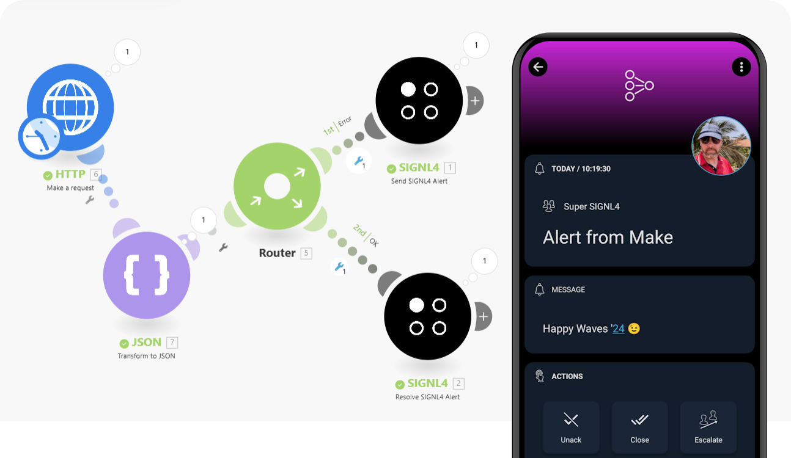
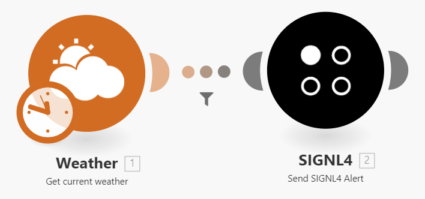

# SIGNL4 Integration with Make.com

[Make](https://www.make.com/) is a visual platform that lets you design, build, and automate anything from simple tasks to complex workflows in minutes. The advanced online automation platform is capable of connecting your Web apps as well as transferring and transforming your data. Pairing Make with SIGNL4 can enhance and automate your daily tasks with an extension to your mobile team no matter where they are.

You can add the SIGNL4 module to any of your scenarios in order to send out reliable alert notifications to your team. In our example we use a super simple weather alert.

A typical example would be a snow or freezing alert. In this case we request the current weather information for a certain city every hour and if the temperature is below zero degrees centigrade or if it is snowing we trigger an alert in SIGNL4.

SIGNL4 is a mobile alert notification app for powerful alerting, alert management and mobile assignment of work items. Get the app at [https://www.signl4.com](https://www.signl4.com/).

## Prerequisites

- A [SIGNL4](https://www.signl4.com/) account
- An account at [Make](https://www.make.com/en?utm_source=seliom&utm_medium=partner&utm_campaign=seliom-partner-program)

## How to Integrate

First, you need to create a new scenario in Make. In our example we just need two modules, Weather and SIGNL4.

Now you will have to add the trigger. Our trigger is time based and we can just configure an interval of one hour here. As our initial action we add “Get current weather” from the Weather module.

Now as our second module we add SIGNL4. From there you select the action “Send SIGNL4 Alert” and you fill in the appropriate values. You can find your SIGNL4 team secret in your SIGNL4 web portal under Teams.

[[Make SIGNL4 Action](make-signl4-action.png)

You can add static text as well as dynamic content from your previous weather request, e.g. description, temperature or location data.

The SIGNL4 action along with additional integration options is available [here](https://www.make.com/en/integrations/signl4?utm_source=signl4&utm_medium=partner&utm_campaign=signl4-partner-program).

You can use filters to send alert notifications only under certain conditions. In our case we only send the notification in case the temperature is below zero degrees centigrade.

[

## Test it

That is it. Now you can save and activate your scenario. And you can test it. Testing is very convenient. You can run your whole scenario (maybe adapt your filter for testing). Or, you can just run the SIGNL4 module. You should then receive an alert on your SIGNL4 app.

The alert in SIGNL4 might look like this.

You can find out more at GitHub: [https://github.com/signl4/signl4-integration-integromat](https://github.com/signl4/signl4-integration-integromat).
