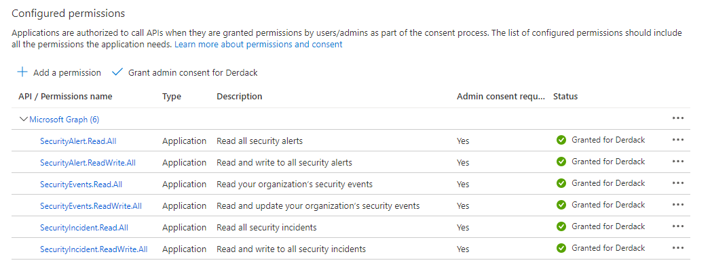
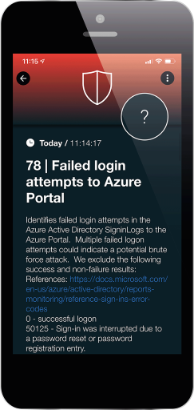

# SIGNL4 Integration with Microsoft Sentinel

SIGNL4 provides a powerful 2-integration with Microsoft Sentinel. It allows to retrieve incidents and to respond to them e.g. via the SIGNL4 mobile app. This includes but is not limited to status updates and adding notes to an incident.

## Feature overview

- Forwarding incidents of your choice (status filtering possible) to SIGNL4
- Ability to augment retrieved events with search result data from the related security alerts of the underlaying log analytics workspace
- Tagging retrieved incidents with a tag of your choice 
- Owner assignment when Signl is acknowledged and or closed
- Incidents notes on status changes in SIGNL4 or when users add annotations in SIGNL4
- User friendly display of linked items (e.g. products or company names)

Learn more about the integration in the following video:

<iframe width="560" height="315" src="https://www.youtube.com/embed/krRJGTxXIHY?si=IC1seK90heGoN2GT" title="YouTube video player" frameborder="0" allow="accelerometer; autoplay; clipboard-write; encrypted-media; gyroscope; picture-in-picture; web-share" referrerpolicy="strict-origin-when-cross-origin" allowfullscreen></iframe>

## How does it work?

The connector polls MS Sentinel API for new incidents in a short interval. Retrieved incidents are then updated with search result data from the log analytics workspace of Sentinel which uses the Log Analytics API. Incident augmentation is optional can be deactivated in the connector configuration.

SIGNL4 uses a dedicated Service Principal which is assigned to a custom user role when calling API methods.

## Setup step 1 - Creating a service principal for SIGNL4 in Azure

SIGNL4 uses a service principal in Azure ("App registration") when making calls to the Azure APIs. In addition, this principal is added to a custom user role which tailors access permissions to a minimum of required resources. And the best is that you don't need to create all these things manually. Instead, you can use a PowerShell script to have this done in a few moments.

### Creating service principal and user role

Follow these steps to create the service principal in Azure:

1. Download the PowerShell deployment script from [here](https://github.com/signl4/signl4-integration-azuresentinel/blob/master/registerSIGNL4Client.ps1).

2. Review the script and the roles and permission scopes it deploys for the new app registration. If you don't want to use the connector with Azure Sentinel, you could remove all role creation and role assignment code and only use it to create the app registration (SPN) in your Azure Active Directory.

3. Make sure you have all dependent modules installed, which are listed on top of the script.

4. Run the script.

    1. Initially, you are prompted to select the subscription in Azure that holds your Sentinel assets. Afterwards, the provisioning of the SPN and the according IAM role is completed automatically. 

    2. At the end it outputs information that you need to enter in the connector app configuration which is explained in the next chapter. Please make a note of this information.

5. In Azure AD, click on 'App Registrations'. Find the app with the name **'AzureSentinel and LogAnalytics Client for SIGNL4'**.

**Note**: If you are service provider and want to attach multiple customer Azure tenants, you must run this script for each of your clients and create multiple connector apps in SIGNL4.

### Optionally assign GraphAPI permissions

The connector app can use Graph Security API to further, non-Sentinel integrated security events from your Azure Subscriptions. If you want to use that functionality (maybe in another connector instance), please open "API permissions" from the details of the registered application and click add permission. Select Graph API on the displayed blade and add the permissions that are displayed in this image:

Finally, make sure to press the button "Grant admin consent".

## Setup step 2 - Create and configure the connector app in SIGNL4

With setup step 1 you have created a service principal in Azure that is used by the connector app when accessing Azure APIs. The service principal credential data consists of the following and must be entered in the connector app configuration:

- Azure tenant ID
- Azure subscription ID
- App client ID
- App client secret

### Create a new connector app in SIGNL4
In SIGNL4, open the Apps menu of your team and search for "Azure Sentinel, SC, etc." and click "Create".

Configure the app parameters as described in the table below.

| Configuration parameter | Description |
| --- | --- |
| Subscription Id | Azure Subscription ID of the subscription you want to get security events from |
| Tenant Id | Your Azure tenant ID |
| Client Id | Client Id that was created and displayed when creating the SPN in Azure using the PS script |
| Client Secret | Client secret that was created and displayed when creating the SPN in Azure using the PS script |
| Azure Sentinel Log Analytics Workspace | Sentinel security events (incidents) can be augmented with search result data of the underlaying security alerts that triggered the incident. The search results often give more context when investigating an incident.  If you leave this field empty, no augmentation will be done by the connector. |
| Azure Sentinel Resource Group | The name of the resource group in which your Microsoft Sentinel solution is deployed. If you read alerts directly from the Sentinel API (see next parameter) this value is required.  Otherwise this value is optional and also used to augment incidents with search results from their underlaying security alerts. |
| Read security events from | You can select the Azure API that is used to read security alerts / incidents from.  If Microsoft Sentinel is your single pane of glass solution for SIEM and all security events are fed into Sentinel, select "Microsoft Sentinel API" here.  If on the other hand, you have assets in Azure that are not integrated with Sentinel and rather use solutions like Defender for Cloud to manage security of those assets, you may select "Microsoft Graph Security API" here. Graph Security API also provides access to security alerts from different sources such as MS Sentinel or Defender for Cloud. |
| Filter Severity | Select incident severities you wish to get Signls for in SIGNL4. you may e.g. deselect low severity. |
| Tags for Sentinel incident after Signl creation | Once an incident was received by SIGNL4, a tag can be added to it. This allows you to keep track of the items that were polled by SIGNL4 inside Sentinel. You can leave this field empty. |

Once ready, click the "Create" button.

The connector attempts to initialize and to read security events from the according API. If that is successful it will be in an OK status. Otherwise you may see an error status with results, e.g. indicating that the credentials did not work when accessing the API.

### Which incidents are retrieved?

In general, only the following Sentinel incidents matching all the below criteria are retrieved by the connector:

- Must be in the status "New"
- Must not be older than 24 hours (created date)
- Must have one of the configured severities

Incidents matching the criteria above are polled and are available as an event in SIGNL4 which creates Signls for your teams as configured in your SIGNL4 tenant.

The alert in SIGNL4 might look like this.

## How can I setup tenancy for Microsoft Sentinel?

Each connector is tailored to a log analytic workspace associated with the unique Azure IDs assigned to each tenant. In essence, it is possible to establish an individual connector for each team to ensure tenancy cohesion across SIGNL4, and to segregate the connectors according to each team's requirements.

