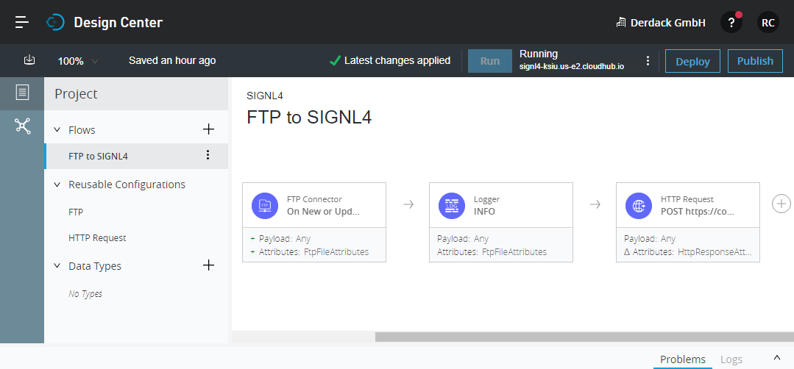
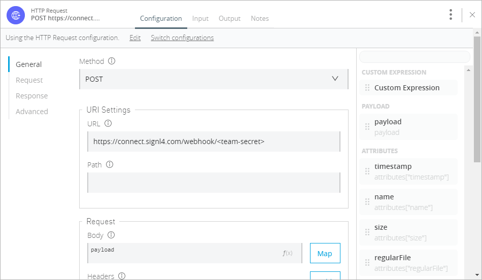

# SIGNL4 Integration with MuleSoft Anypoint

[MuleSoft’s Anypoint Platform](https://anypoint.mulesoft.com/) is a leading integration platform for SOA, SaaS, and APIs. It provides business agility to companies by connecting applications, data, and devices, both on-premises and in the cloud with an API-led approach. Pairing this powerful platform with SIGNL4 can enhance your daily operations with an extension to your team wherever it is.

In our example we will read files from an FTP server and send the data as an alert to our SIGNL4 team.

SIGNL4 is a mobile alert notification app for powerful alerting, alert management and mobile assignment of work items. Get the app at https://www.signl4.com.

## Prerequisites

- A SIGNL4 ([https://www.signl4.com](https://www.signl4.com/)) account
- An MuleSoft Anypoint ([https://anypoint.mulesoft.com](https://anypoint.mulesoft.com/)) account
- An FTP server for testing (optional)

## How to Integrate

Log on to the MuleSoft Anypoint platform at [https://anypoint.mulesoft.com](https://anypoint.mulesoft.com/) and go to the Design Center. Here you can create a new project.

Now you can create a new flow consisting of three steps:

1. FTP Connector: Reads files from an FTP server in certain intervals. You define your FTP server here.  
2. Logger: This is optional and just to see some logging information when the FTP connected was reading new files.  
3. HTTP Request: Here we send the HTTP request to SIGNL4 in order to send the alert.



We send an HTTP Push request to SIGNL4 in order to trigger an alert. The URL is your SIGNL4 webhook URL including your team secret. The content-type is application/json and the Body is the JSON payload. In our case we take the content of the file from our FTP server.

For testing you can create a .json file for example with the following content:

```json
{
    "Alert": "FTP: MuleSoft",
    "Message": "Application error on server A20x."
}
```

Upload the file to your FTP server and then the MuleSoft AnyPoint Flow will read the file and send the content to SIGNL4. Your SIGNL4 team will get the alert.

You can find a sample in GitHub:  
[https://github.com/signl4/signl4-integration-mulesoft](https://github.com/signl4/signl4-integration-mulesoft)



The alert in SIGNL4 might look like this.


