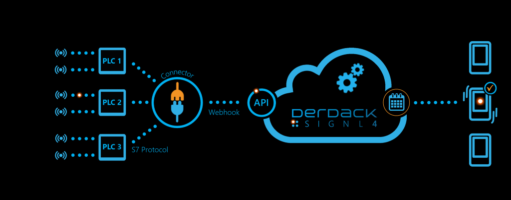
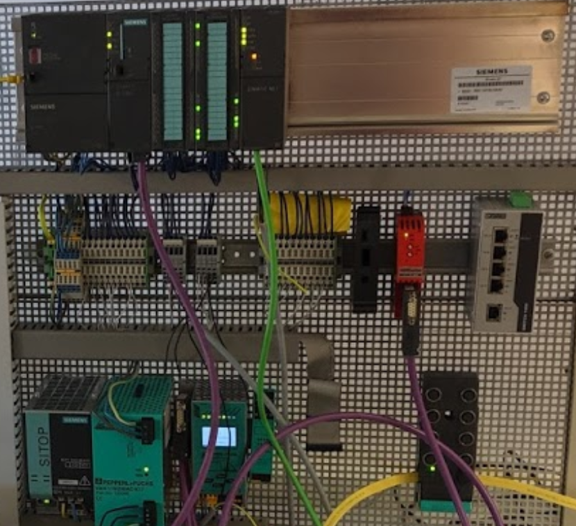
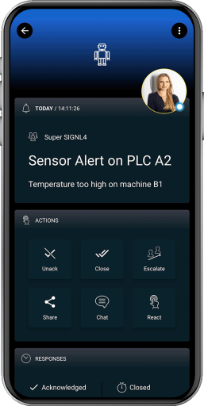

---
title: PLC / S7
parent: Integrations
---

# SIGNL4 Integration with PLC's via S7

In our example we use a PLC with a couple of I/O contacts connected. We retrieve the I/O information from the PLC and send an alert to our SIGNL4 team in case an I/O contact is closed.

SIGNL4 is a mobile alert notification app for powerful alerting, alert management and mobile assignment of work items. Get the app at [https://www.signl4.com](https://www.signl4.com/).

## Prerequisites

- A SIGNL4 account ([https://www.signl4.com](https://www.signl4.com/))
- A PLC (supporting the S7 protocol)

If not already done we setup the PLC. That means we connect it to the network and connect the sensors or I/O contacts. The PLC needs to be reachable via IP and we need to know the address data within the PLC.

## The Connector App

The connector app runs on a dedicated machine (Windows or Linux) and is based on Node.js. It connects to the PLC via the S7 protocol and sends event information to SIGNL4 when certain conditions are met.

In order to query information from the PLC’s some additional information is required. This is for example information about the IP addresses of the PLC’s, the data addresses within the PLC’s and the conditions when to trigger events.

This information is contained in the database table "S7ConnectorAlerts". Here comes a simplified description of the contained columns.

| Field        | Description                                           |
|--------------|-------------------------------------------------------|
| IP           | Primary Key                                           |
| IP           | IP address of the PLC                                 |
| Rack         | S7 rack identifier                                    |
| Slot         | S7 slot identifier                                    |
| Message      | An additional message parameter for the event         |
| Location     | An additional location parameter for the event        |
| Priority     | Alert priority                                        |
| AlertAddress | The address within the PLC to be queried              |
| AlertOn

Besides this the SIGNL4 webhook URL including team secret needs to be configured in the connector app. The app will send query the PLC’s in certain intervals and send events to SIGNL4 when a condition is met, in our case when an I/O contact is closed.

Please contact us for more information about how to obtain the connector app.

## Network Considerations

For the test setup the PLC just needs to be reachable from our connector app (see above). In production the PLC might be in a closed process network with no access to the Internet. In this case the connector app can be installed in another network, for example in the office network or in the DMZ. From there it requests data from the PLC’s using dedicated IP addresses and ports and on the other side it communicates with the SIGNL4 cloud via HTTPS.

This is it. You can now test your IoT scenario by simulating an appropriate event, in our case you can close an I/O contact. You will then receive an alert in your SIGNL4 app.

The alert in SIGNL4 might look like this.

