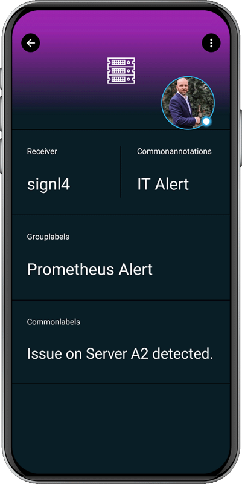

# SIGNL4 Integration with Prometheus Alertmanager

When critical systems fail, SIGNL4 is the fastest way to alert your staff, engineers, IT admins on call and “in the field”. SIGNL4 provides reliable notifications via mobile app push, text and voice calls with tracking, escalations and duty scheduling.

[Prometheus](https://prometheus.io/) is an open-source monitoring tool that monitors availability and performance. It gives you simple access to relevant data for example using [Grafana](https://www.signl4.com/blog/portfolio_item/grafana-mobile-alert-notification-app-text-voice-call/). SIGNL4 easily enables Prometheus to notify mobile teams in the field or on call in real-time. This speeds up their response significantly and frees resources in the operations.

Pairing Prometheus Alertmanager with SIGNL4 can enhance your daily operations with an extension to your team wherever it is. The integration does not only allow you to know when a critical issue has occurred but also when it was resolved no matter where you are.

The integration of Prometheus and SIGNL4 is done using the Alertmanager that is part of Prometheus.

## Prerequisites

- A SIGNL4 account ([https://www.signl4.com](https://www.signl4.com/))
- A Prometheus installation ([https://prometheus.io](https://prometheus.io/))
- An Alertmanager installation ([https://prometheus.io/docs/prometheus/latest/configuration/alerting\_rules/](https://prometheus.io/docs/prometheus/latest/configuration/alerting_rules/))

## How to Integrate

### Alertmanager Webhook

The integration is done using the standard webhook in Alertmanager. You can find more information here:

[https://prometheus.io/docs/alerting/latest/configuration/#webhook\_config](https://prometheus.io/docs/alerting/latest/configuration/#webhook_config)

A sample configuration in the configuration file might look like this:

```yaml
receivers:
- name: prometheus-signl4
  webhook_configs:
  - url: https://connect.signl4.com/webhook/
    send_resolved: true
route:
  group_by:
  - job
  group_interval: 5m
  group_wait: 30s
  receiver: prometheus-signl4
  repeat_interval: 10m
  routes:
  - matchers:
      - alertname = "Watchdog"
    receiver: prometheus-signl4
```

You need to replace with your SIGNL4 team secret.

### Resolved Alerts

In order to close alerts in SIGNL4 when the alerts are closed in Prometheus you can use this SIGNL4 URL.

```
https://connect.signl4.com/webhook/{teamSecret}?ExtIDParam=groupKey&ExtStatusParam=status&ResolvedStatus=resolved
```

You can find more information about the resolve feature here:

[https://www.signl4.com/blog/update-july-2020-resolve-alerts/](https://www.signl4.com/blog/update-july-2020-resolve-alerts/)

## Test It

That is it and now you can test the alert. You can for example simulate an alert in Prometheus and you should then receive an alert in your SIGNL4 app.

The alert in SIGNL4 might look like this.


