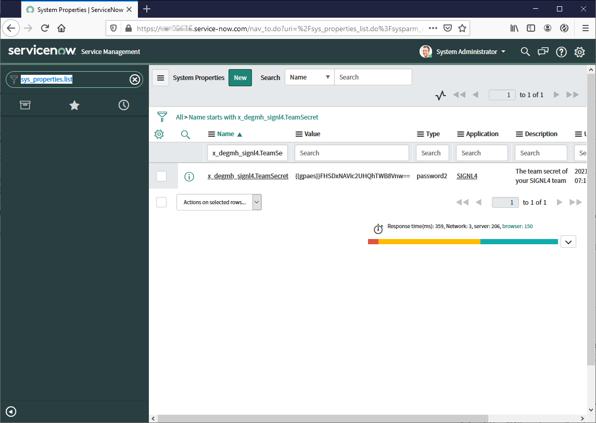
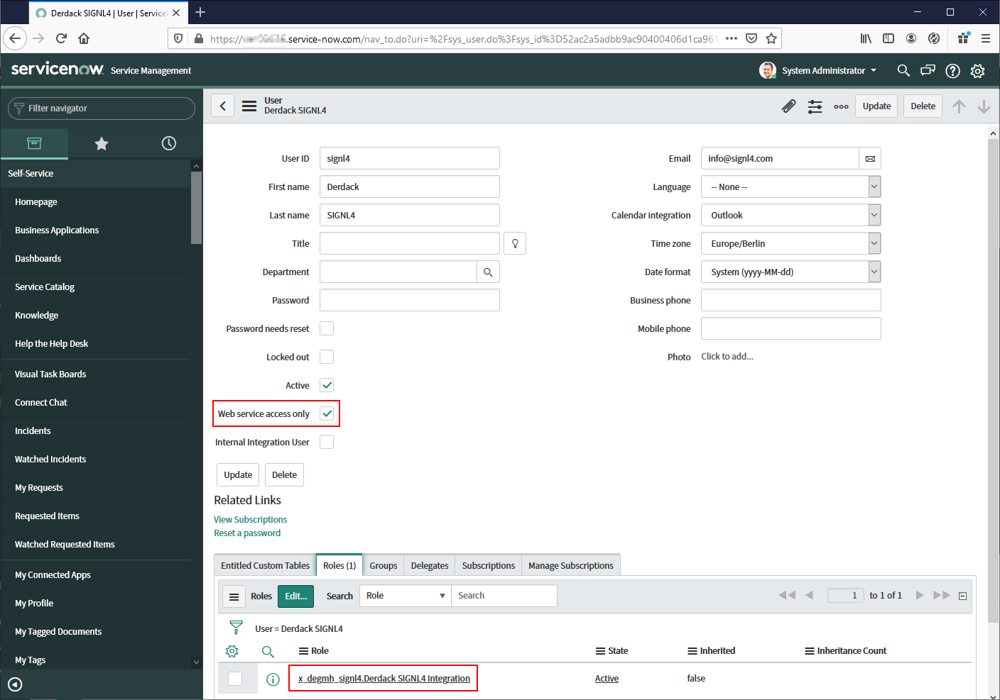
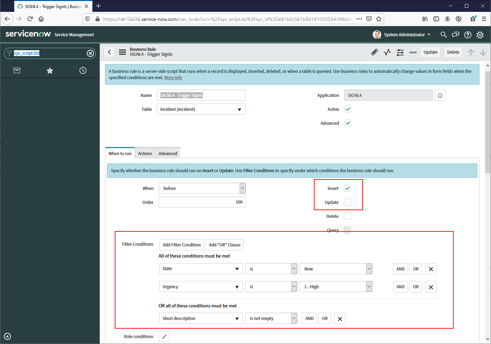
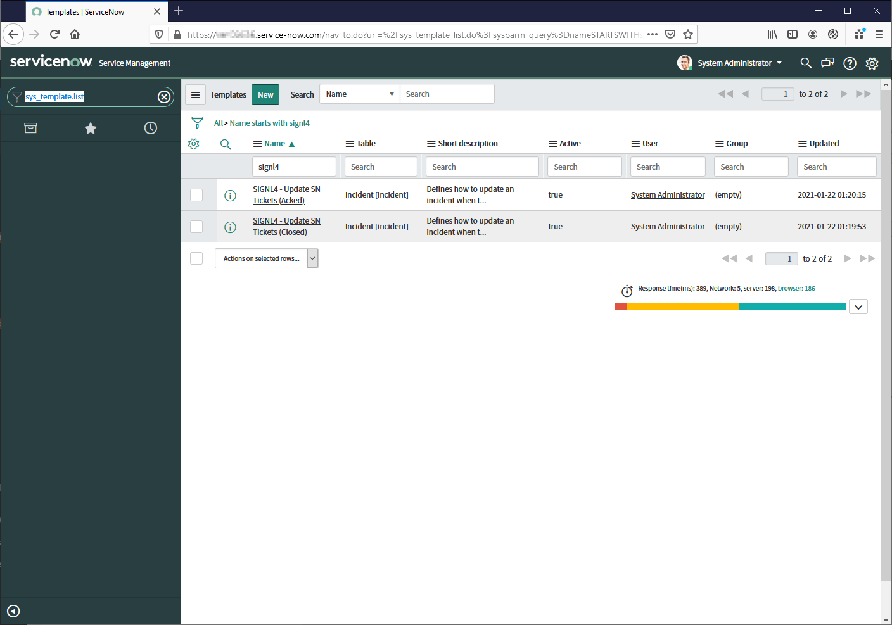
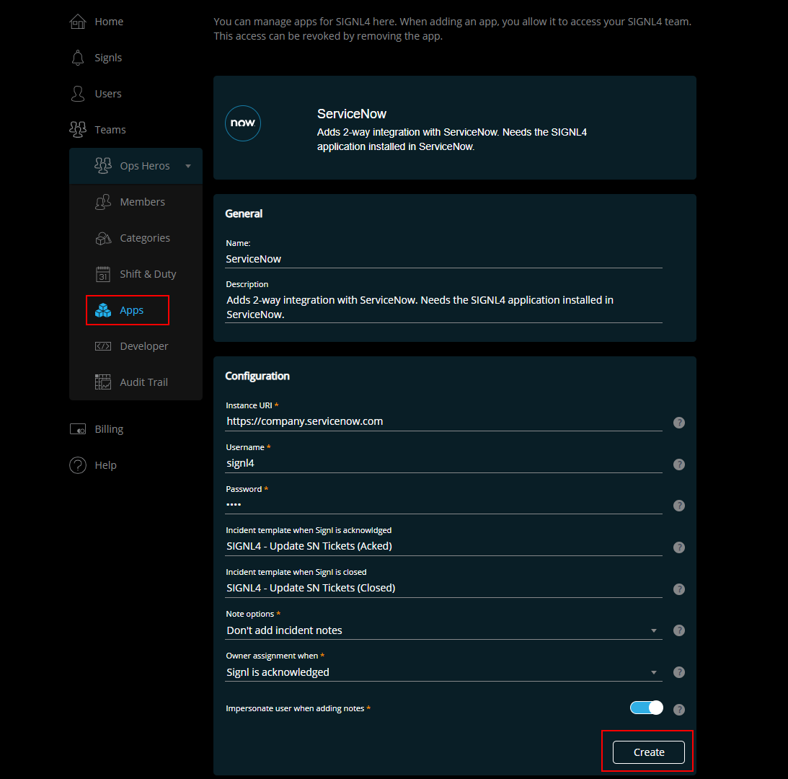
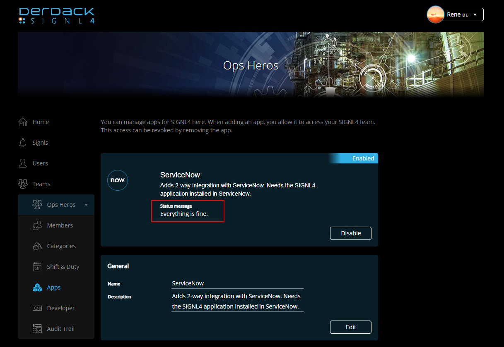
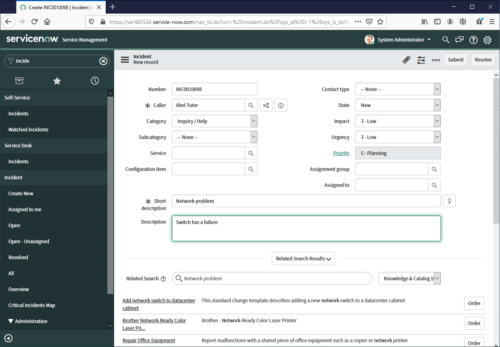
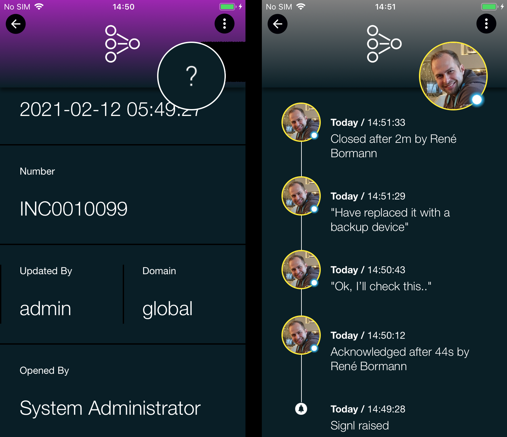
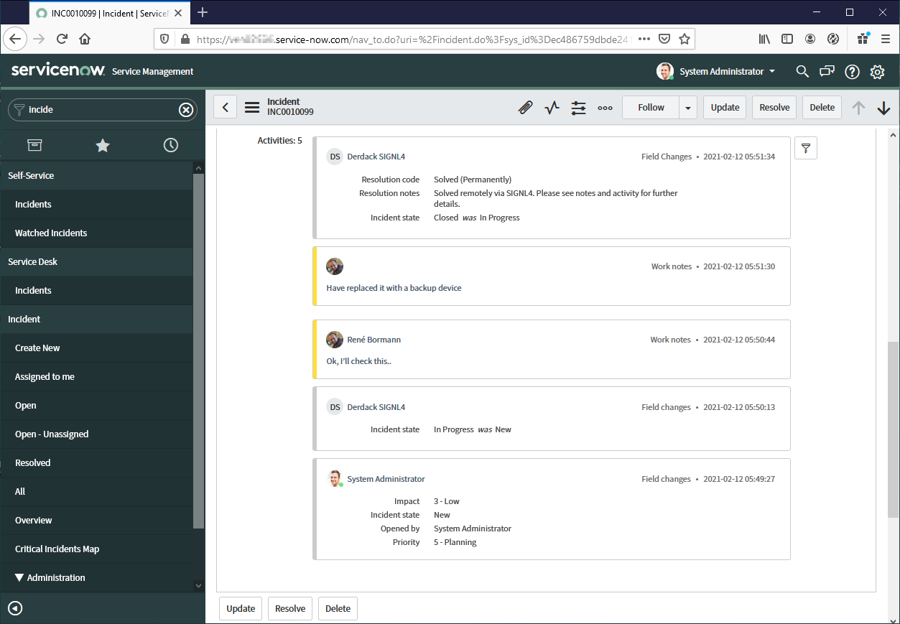

# SIGNL4 Integration with ServiceNow

SIGNL4 is your platform for adding targeted and persistent mobile incident response to your ServiceNow incidents and for effectively scheduling and managing on-call staff. SIGNL4 give you peace of mind while away from your desk and while on-call. Our comprehensive on-call management and built-in duty scheduling fully automate the communication of incidents by addressing them to the right people at the right time, reducing noise and alert fatigue. Using SIGNL4 helps you to resolve incidents up to 10x faster, ensuring that you meet your SLAs and user expectations.

SIGNL4 integrates with ServiceNow via a ServiceNow app for pushing relevant incidents to SIGNL4. To update incidents in SIGNL4 uses a 2nd connector app to communicate with ServiceNow.  Any relevant incidents can then be communicated to on-call teams or engineers in the field leading to an instant anywhere response. Engineers can acknowledge, update, close and annotate incident tickets on-the-go using SIGNL4’s user-friendly, advanced mobile app.

## Installation and Account-Linking

1. Install the SIGNL4 application in ServiceNow. You can install it e.g. [from the Store](https://store.servicenow.com/sn_appstore_store.do#!/store/application/74c6c9a91b1d9010a621ff72cd4bcbad/) or you can install the application directly in your ServiceNow instance under "System Applications" -> "All Available Applications" -> "All" by simply searching for "SIGNL4" there.

2. Download and follow the [ServiceNow SIGNL4 installation guide](https://store.servicenow.com/appStoreAttachments.do?sys_id=9c746e38db0ea4501e5c56a8dc9619bc).

## Create the integration user account

Next, you create an account for SIGNL4 in your ServiceNow instance. SIGNL4 then uses this account to access an inbound REST API that is part of the SIGNL4 application in ServiceNow. It handles incidents by, for example, assigning them an incident template (also part of the application) when a Signl has been acknowledged.

1. Enter "sys_user.list" in the navigator and open the user management.

2. Now create a new user with these characteristics:

- User ID: signl4
- First Name: Derdack
- Last Name: SIGNL4
- Email: info@signl4.com

3. Once the user is created, you assign him a special role, which is also part of the SIGNL4 application in ServiceNow. This role does not include any access rights as the access management for the application is purely based on the ServiceNow Scoped-Application sand-boxing model (The application uses the “Runtime Access Tracking” mode “Tracking” here).  
However, it is used to detect if the SIGNL4 connector has modified an Incident or if a ServiceNow user has modified it. Thus event loop-backs are prevented.

- In the opened record of the user click on "Edit" at the bottom of the page at "Roles".
- On the next page enter "x_degmh_signl4.Derdack SIGNL4 Integration" into the search field and add the found role to the user. Done.

4. It is important to only allow the user to log in via the web service. This way the user cannot log in to the ServiceNow portal which increases the security a bit. More details [can be found here](https://docs.servicenow.com/bundle/paris-platform-administration/page/administer/users-and-groups/concept/c_NonInteractiveSessions.html).

- Just set the checkbox "Web service access only" in the user record.

## Customize Business Rule criteria (optional)

You define which incidents are forwarded to your SIGNL4 team using the criteria of a business rule, which is also part of the SIGNL4 ServiceNow application. By default, pretty much every new incident is sent to SIGNL4. To change this, follow these steps:

1. In the Navigator, type "sys_script.list".

2. Search for the rule named "SIGNL4 – Trigger Signls".

3. Now adjust the "When to run" criteria of the rule to your needs. You can specify whether incidents are only forwarded when they are first created (INSERT trigger) or also when they are updated (UPDATE trigger). You can also adjust the conditions an incident must have to be forwarded (e.g. high priority).

There is also the possibility to define how a forwarded incident has to change in order to close the corresponding Signl in SIGNL4. This is done by another business rule, which you can also customize:

1. In the Navigator, type "sys_script.list".

2. Search for the rule with the name "SIGNL4 – Update Signls".

3. The default criteria captures an incident status of “Closed” but you can customize it to close the Signl when the incident status is e.g.  “Resolved”.

## Customize Incident Templates (optional)

SIGNL4 offers a unique 2-way integration with ServiceNow. So when Signls are acknowledged or closed, the incident can be updated accordingly and the status can be set as well. This is done via incident templates, one for updating when the Signl is acknowledged and one when it gets closed. You can customize both as follows:

1. Enter "sys_template.list" in the navigator.

2. Then search for "signl4" in the name column.  
Two search results will be displayed:

3. "SIGNL4 – Update SN Tickets (Acked)" defines how an incident is updated when a Signl has been acknowledged, e.g. in the SIGNL4 mobile app. You can set the status here to "In Progress" for example.

4. "SIGNL4 – Update SN Tickets (Closed)" defines how an incident is updated when a Signl has been closed, e.g. in the SIGNL4 mobile app. You can set the status here to "Closed" for example.

## 2-way Integration – Create the Connector App in SIGNL4

In order for 2-way integration to work and for incidents to be updated in ServiceNow when commenting, acknowledging, or closing according Signls, you still need to create the SIGNL4 connector app for your SIGNL4 team. This is super easy:

1. Log in to [SIGNL4](https://account.signl4.com/manage)

2. Select the appropriate team and click on Apps in the menu.

3. Then search for ServiceNow in the app template (or in the search box on the right side of the page).

4. Click on create

5. Next, quickly configure the connector app values described below:

- **Instance URI**:  
    The root URL of your ServiceNow instance without any additional path. An example is https://company.servicenow.com
- **Username**:  
    SIGNL4 will access your ServiceNow instance as this user which needs to be created in ServiceNow. Mkae sure to only allow Web service access when creating the user in ServiceNow.
- **Password**:  
    The password of the SIGNL4 user account in ServiceNow
- **Incident template when Signl is acknowledged:**  
    Incident template to apply when Signl is acknowledged in SIGNL4. The default value refers to a template that is part of the SIGNL4 ServiceNow application and updates the incident status to ‘In Progress’. If you leave this field empty, not incident template is applied when users acknowledge in SIGNL4.
- **Incident template when Signl is closed:**  
    Incident template to apply when Signl is acknowledged in SIGNL4. The default value refers to a template that is part of the SIGNL4 ServiceNow application and updates the incident status to ‘Closed’. If you leave this field empty, not incident template is applied when users close in SIGNL4.
- **Note options:**  
    When a user in SIGNL4 annotates a Signl, the annotation can be added as incident note in ServiceNow. Select the note type in that case or disable adding notes to ServiceNow incidents.
- **Owner assignment when:**  
    When a user in SIGNL4 acknowledges or closes a Signl, he or she can be assigned to the incident. Select on which status changes this should be done. Please note that the incident will also be assigned to a support group the user if member of, in case the user is member of only one group in ServiceNow.
- I**mpersonate user when adding notes:**  
    If disabled, notes will always be added as the integration user account (SIGNL4), which may not be very meaningful in ServiceNow. If email addresses for ServiceNow and SIGNL4 users match, they can also be added as the user who actually authored them. If you enable this setting, notes will be inserted to ServiceNow tables directly.
    
    - This requires CREATE persmissions on the tables "sys_audit", "sys_journal_field" and "sys_history_line".
    - Pull them up by "Name" in the list view that gets displayed when typing "sys_db_object.list" in the Navigator field.
    - Enable "Can create" permission on the "Application Access" tab for each table.
    - Consider disabling these permissions then for individual other applications in your ServiceNow instance by entering "sys_scope_privilege.list" in the Navigator field.

6. Click "Create". If the account data is OK and there are no authorization errors, the app is launched and you are ready to go.

## Let’s go – Testing the configuration

Now that you’ve created the SIGNL4 app in ServiceNow and also added the ServiceNow connector app to your SIGNL4 team, you’re finally ready to go. We’ll log a new incident, get it on the SIGNL4 app and will update it from there:

1. Log in everywhere, i.e. in your ServiceNow instance, in [SIGNL4](https://account.signl4.com/manage) and also in the SIGNL4 mobile app.

2. Now create a new incident in your ServiceNow instance that meets the criteria of the business rule "SIGNL4 – Trigger Signls".

3. The incident will then be forwarded to SIGNL4 and you will see the Signl both in the web portal and in the mobile app

4. Now you acknowledge the signl in SIGNL4, either in the portal under “Signls” or in the mobile app by pressing the circle button.

5. This status change is now transferred to ServiceNow by applying the template “SIGNL4 – Update SN Tickets (Acked)” to the previously created incident.

- Add some annotations to the incident in SIGNL4.
    - These annotations will be added to the incident in ServiceNow as notes.
- Close the incident in SIGNL4
    - This status change will now be transferred to ServiceNow by applying the template “SIGNL4 – Update SN Tickets (Closed)” to the previously created incident.

## Compatibility

The SIGNL4 application is at least compatible following ServiceNow versions:
- Xanadu
- Washington DC
- Vancouver
- Utah
