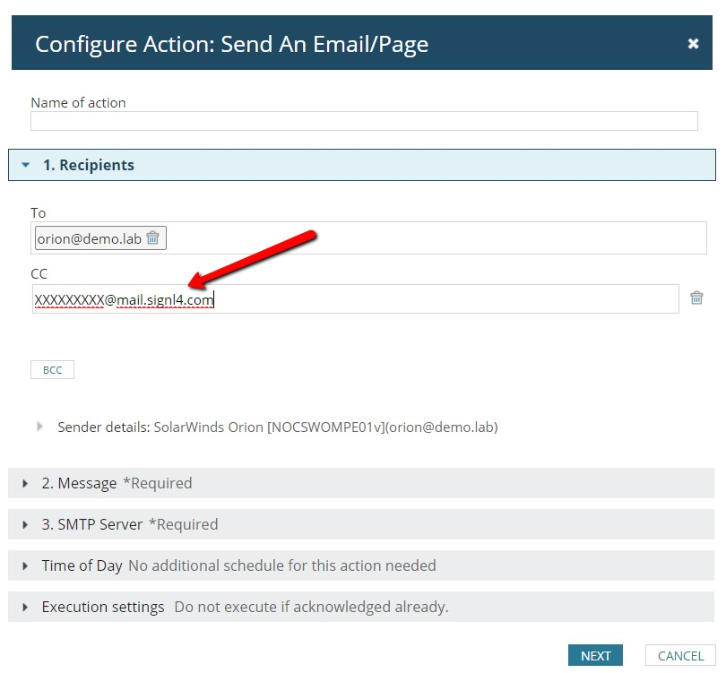
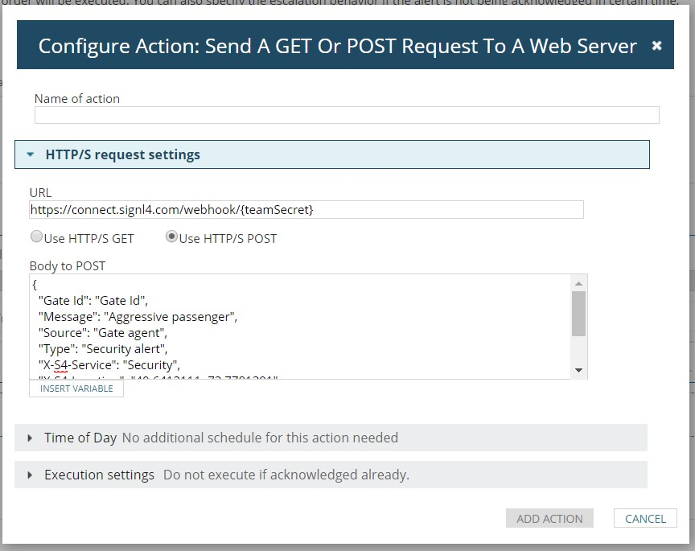

# SIGNL4 Integration with Solarwinds NPM

SolarWinds can send out alerts, but all too often the emails that are sent from critical events are missed. SIGNL4 ensures that all on duty members receive, acknowledge and resolve those critical alerts, all from their smartphones. With persistent notifications and escalation chains there will never be a critical alert that goes unattended. SIGNL4 also offers ad-hoc collaboration between team members for each and every alert, so Subject Matter Experts can be looped in to help resolve issues.

SIGNL4 notifies teams on their mobile devices when custom alert conditions are met in SolarWinds NPM.

### How to integrate

From the main dashboard go to Alerts & Activity -> Alerts.

Select an Alert then click on Edit Alert Definition.

Once you are editing the alert click on Triggers Actions.

In the Trigger Actions section click on Add Action.

The simplest form of getting this alert to SIGNL4 is to send an email to the SIGNL4 email address.

If you are already receiving emails to an inbox, just add the SIGNL4 email as a CC.

You can also send a Post Request to the signal.

Enter the URL provided by SIGNL4 and the message that you want delivered.  SIGNL4 will receive this message and generate an alert.

With either of these actions added SIGNL4 will receive the alert and notify on duty members of that team.

The alert in SIGNL4 might look like this.

