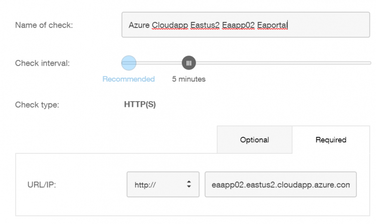

# SIGNL4 Integration with Solarwins Pingdom

In our example we are using Pingdom to monitor the up-time of critical servers.  We are setting up a webhook to send alerts when the application servers website can be reached.

SIGNL4 is a mobile alert notification app for powerful alerting, alert management and mobile assignment of work items.  Get the app at [https://www.signl4.com](https://www.signl4.com/)

## Prerequisites

- A SIGNL4 ([https://www.signl4.com](https://www.signl4.com/)) account
- A Pingdom ([https://my.pingdom.com](https://my.pingdom.com/)) account

### How to integrate

First setup a webhook integration to connect Pingdom and SIGNL4. Under the Integrations menu item click on Integrations.

Click on Add Integration.

Populate the Name and SIGNL4 webhook URL.

Save Integration.

We are going to add a check for an application servers website URL. Under Experience Monitoring click on Up-time.

Add New.

Populate the trigger with the desired Name, Check Interval and URL.

In the Connect Integrations section put a check mark in the webhook created in step 4.

Now whenever the URL is unreachable an alert will trigger within Pingdom and send the event data to SIGNL4 via a JSON Post.  Customized messages are available within the alert policy.  SIGNL4 will receive the parameters and separate it out in an easy to read format.

The alert in SIGNL4 might look like this.

