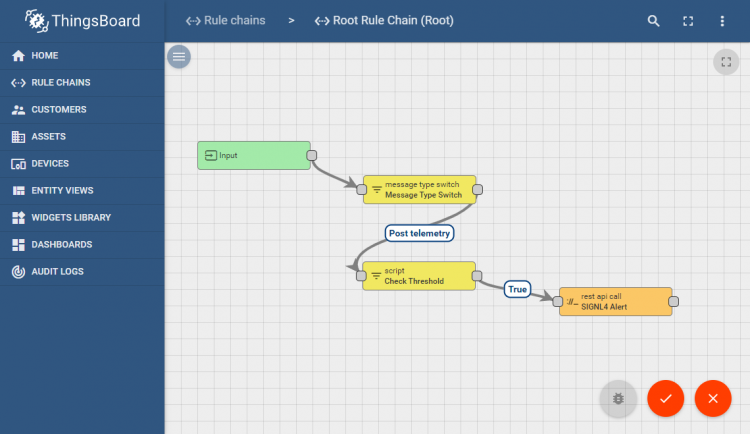

# SIGNL4 Integration with ThingsBoard

In our example we ThingsBoard installed on Linux and we simulate a temperature alert. When the temperature is too high we send an alert to our SIGNL4 team.

SIGNL4 is a mobile alert notification app for powerful alerting, alert management and mobile assignment of work items. Get the app at [https://www.signl4.com](https://www.signl4.com/).

## Prerequisites

- A SIGNL4 account ([https://www.signl4.com](https://www.signl4.com/))
- An ThingsBoard installation ([https://thingsboard.io](https://thingsboard.io/))

## How it works

### Create a Rule Chain

You can use ThingsBoard on-premise or in the cloud. In our example we use the on-permise version and you can find the installation instructions here:  
[https://thingsboard.io/docs/user-guide/install/installation-options/?ceInstallType=onPremise](https://thingsboard.io/docs/user-guide/install/installation-options/?ceInstallType=onPremise)

In your ThingsBoard portal you can create a new Rule Cain or edit the Root Chain.



### Add the REST API Call

Add the Node REST API Call to your Rule Chain. This one sends the HTTP Post request to SIGNL4. The URL is your SIGNL4 webhook URL along with your team secret. The Body is the msg.payload data from the previous step.

You can now connect this node where you want to send an alarm. In our case we use a data from a device which we are still examining according to certain criteria (temperature too high).


## Test it

In order to test the setup we can simulate a device event. If you do not have a real device connected you can simulate this with a command line call like this:

```bash
curl -v -X POST -d "{"title": "ThingsBoard Alert", "message": "Temperature too high.", "temperature": 28}" http://localhost:8080/api/v1/A1\_TEST\_TOKEN/telemetry –header "Content-Type:application/json"
```

You can find a more detailed description about the different curl commands here:  
[https://thingsboard.io/docs/getting-started-guides/helloworld/](https://thingsboard.io/docs/getting-started-guides/helloworld/)

This is it. You can now test your IoT scenario by simulating the temperature change. You will then receive an alert in your SIGNL4 app.

You can find a sample in GitHub:  
[https://github.com/signl4/signl4-integration-thingsboard](https://github.com/signl4/signl4-integration-thingsboard)

The alert in SIGNL4 might look like this.


