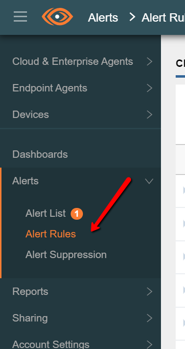
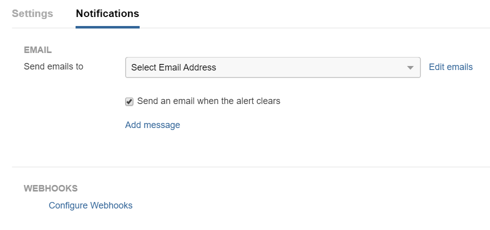
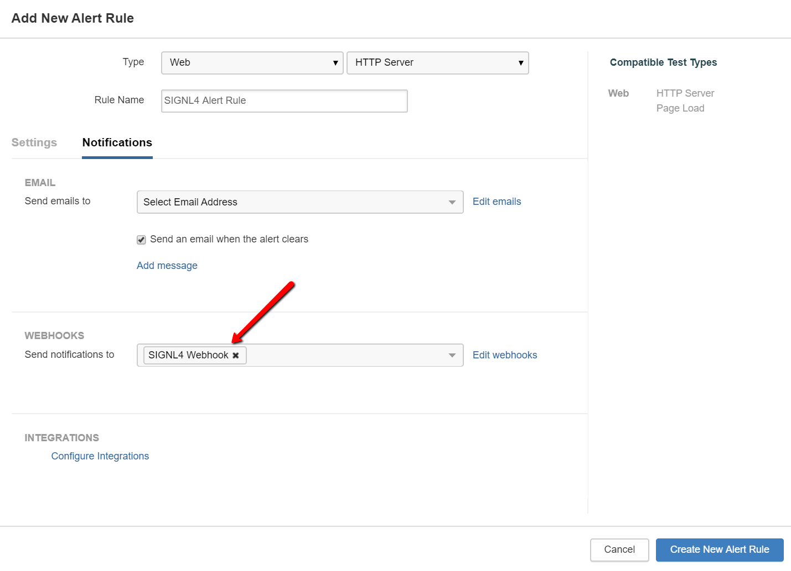

# SIGNL4 Integration with ThousendEyes

[ThousandEyes](https://www.thousandeyes.com/) is a cloud-based SaaS performance monitor with easy to configure dashboards and user setup.  SIGNL4 ensures that all on duty members receive, acknowledge and resolve critical alerts, all from their smartphones. With persistent notifications and escalation chains there will never be a critical alert that goes unattended. SIGNL4 also offers ad-hoc collaboration between team members for each and every alert, so Subject Matter Experts can be looped in to help resolve issues.

In our example we are using ThousandEyes to monitor the up-time of critical servers.  We are setting up a SIGNL4 Webhook as the method of receiving the alerts.

SIGNL4 is a mobile alert notification app for powerful alerting, alert management and mobile assignment of work items.  Get the app at [https://www.signl4.com](https://www.signl4.com/).

## Prerequisites

- A SIGNL4 ([https://www.signl4.com](https://www.signl4.com/)) account
- A ThousandEyes ([https://www.thousandeyes.com](https://www.thousandeyes.com/)) account

## How to integrate

Add or edit an Alert Rule by selecting Alerts and Alert Rules.

In the **Notifications** section click on Configure Webhook.

Give it a name and enter the URL of the SIGNL4 webhook associated with your account.

Be sure to select the newly created webhook in the alert rule.

Click on Create New Alert Rule or Save.

That’s it! The next time this alert is triggered, data will be sent from ThousandEyes to your SIGNL4 team.

The alert in SIGNL4 might look like this.

