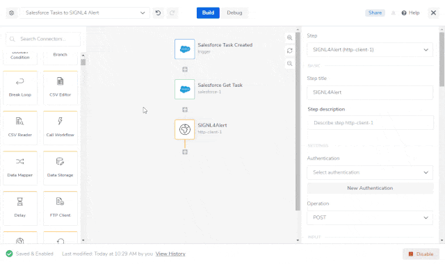

# SIGNL4 Integration with Tray.io

In our example we will send information about a new Task in Salesforce to our SIGNL4 team.

SIGNL4 is a mobile alert notification app for powerful alerting, alert management and mobile assignment of work items. Get the app at [https://www.signl4.com](https://www.signl4.com/).

## Prerequisites

- A SIGNL4 ([https://www.signl4.com](https://www.signl4.com/)) account
- A Tray.io ([https://www.tray.io](https://www.tray.io/)) account

A Salesforce account ([https://www.salesforce.com](https://www.salesforce.com/)) for our example (optional)

## How it works

Log on to the Tray.io platform at [https://app.tray.io](https://app.tray.io/).

Now you can create a new workflow consisting of three steps:

1. Trigger: Salesforce Task Created  
2. Salesforce Get Task  
3. Http Client: Here we send the HTTP POST request to SIGNL4 in order to trigger the alert.

Our Trigger is a Salesforce Connector with the operation On Record Create or Update. This requires an authentication with your existing Salesforce account. The Trigger will start our flow each time a new Task has been created in Salesforce.

The second step in our flows is a Salesforce Connector with the operation Find records and with the Record type Task. We use this to find the previously creates task with the Activity ID $.steps.trigger.Id.

We send an HTTP Push request to SIGNL4 in order to trigger an alert. The URL is your SIGNL4 webhook URL including your team secret. The content-type is application/json and the Body is the JSON payload. In our case we assemble the body dynamically from the Salesforce Task data.

For testing you can create a new Task in Salesforce. This will trigger the workflow in Tray.io and as a result send the task data to your SIGNL4 team.

.png)

You can find a sample in GitHub:  
[https://github.com/signl4/signl4-integration-tray-io](https://github.com/signl4/signl4-integration-tray-io)

The alert in SIGNL4 might look like this.

