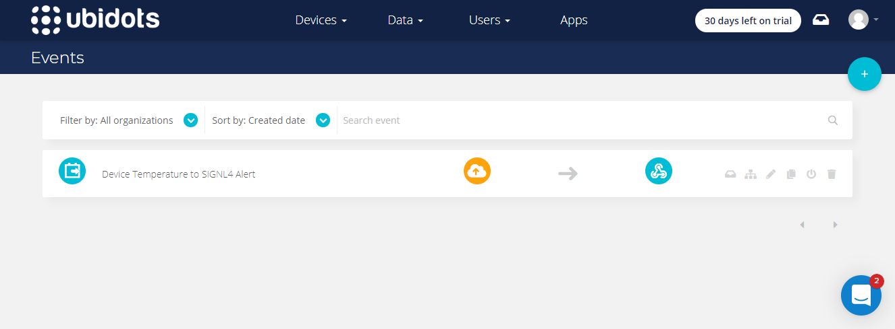
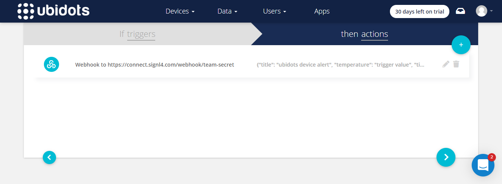

# SIGNL4 Integration with Ubidots

In our example we use a Raspberry Pi as a device and connect it to the Ubidots platform to simulate a temperature alert. When the temperature is too high we send an alert to our SIGNL4 team.

SIGNL4 is a mobile alert notification app for powerful alerting, alert management and mobile assignment of work items. Get the app at [https://www.signl4.com](https://www.signl4.com/).

## Prerequisites
- A SIGNL4 account ([https://www.signl4.com](https://www.signl4.com/))
- A Ubidots account ([https://ubidots.com](https://ubidots.com/))

## How to integrate

In our case we connect a Raspberry Pi as described here: [https://help.ubidots.com/en/articles/513309-connect-the-raspberry-pi-with-ubidots](https://help.ubidots.com/en/articles/513309-connect-the-raspberry-pi-with-ubidots). We use the Pythos script mentioned in the link to generate events.

In the Ubidots portal under Data -> Events you can create a new event.

In the Trigger of the new event you can specify conditions. In our example we check if the temperature is greater than 40 degrees.

As Action select webhook and configure the SIGNL4 webhook URL including your team secret as URL. The body consists of the data you want to send to SIGNL4 in JSON format.

The Action now looks like this.

In the last step you can configure the time periods in which the event should be active.

In order to test the setup we can simulate a device event. In our example we can just start the Python script on the Raspberry by.

This is it. You can now test your IoT scenario by simulating the temperature change. You will then receive an alert in your SIGNL4 app.

You can find a sample in GitHub:  
[https://github.com/signl4/signl4-integration-ubidots](https://github.com/signl4/signl4-integration-ubidots)

The alert in SIGNL4 might look like this.

