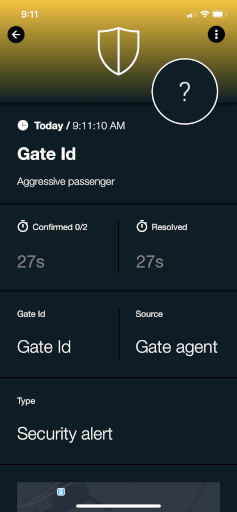
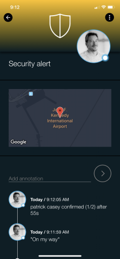

# SIGNL4 Integration with Webhook

The SIGNL4 webhook allows you to send events to your SIGNL4 team from external systems or applications. The base URL of the webhook is https://connect.signl4.com/webhook/. Other than the SIGNL4 API, authentication is based on an API key which is encoded in the request URI and matches your SIGNL4 team secret such as https://connect.signl4.com/webhook/{teamSecret}.

In our example we are using the Raise Event API to send event data to SIGNL4.  These parameters will be parsed and separated automatically in the mobile app and with the use of SIGNL4 special parameters we will be able to trigger specific categories, specify a location and trigger a specific acknowledgement type.

You can find more information about how to setup the webhooks in our [getting-started documentation](https://signl4.zendesk.com/hc/en-us/articles/9005939160093-Getting-started).

### Integration Steps

The payload that we will pass through will be:

```json
{
    "Gate Id": "Gate Id",
    "Message": "Aggressive passenger",
    "Source": "Gate agent",
    "Type": "Security alert",
    "X-S4-Service": "Security",
    "X-S4-Location": "40.6413111,-73.7781391",
    "X-S4-AlertingScenario": "multi_ack",
    "X-S4-ExternalID": "INC091210"
}
```

The following parameters will enrich your Signl or to influence its processing as follows:

**X-S4-Service**:  
Assigns the Signl to the service/system category with the specified name.

**X-S4-Location**:  
Transmit location information (‘latitude, longitude’) with your event and display a map in the mobile app.

**X-S4-AlertingScenario**:  
Pass ‘single_ack’ if only one persons needs to confirm this Signl. Pass ‘multi_ack’ in case this alert must be confirmed by the number of people who are on duty at the time this Singl is raised.

**X-S4-ExternalID**:  
If the event originates from a record in a 3rd party system, use this parameter to pass the unique ID of that record. That ID will be communicated in outbound webhook notifications from SIGNL4, which is great for correlation/synchronization of that record with the Signl.

**X-S4-Filtering**:  
Specify a boolean value of true or false to apply event filtering for this event, or not. If set to true, the event will only trigger a notification to the team, if it contains at least one keyword from one of your services and system categories (i.e. it is whitelisted).

**X-S4-Status**:  
Updates the status of an existing alert event. Please note that the parameter "X-S4-ExternalID" must be the same as for the initial request that opened the alert. The parameter "X-S4-Status" must be "resolved" to close the alert. If the parameter "X-S4-Status" is present and neither "new" nor "resolved" the event gets discarded. This is useful if you would like to ignore updates.

You can try these steps out at the following URL:

```
https://connect.signl4.com/webhook/docs/index.html
```

Open the description by clicking the "POST" button.

Enter in Your Team Secret.

Enter in the event data.

Click "Try it Out".




In June 2020 we introduce the ability to use the webhook to update the status of an alert from the originating 3rd party system. Read more here: [https://www.signl4.com/blog/update-july-2020-resolve-alerts/](https://www.signl4.com/blog/update-july-2020-resolve-alerts/)
