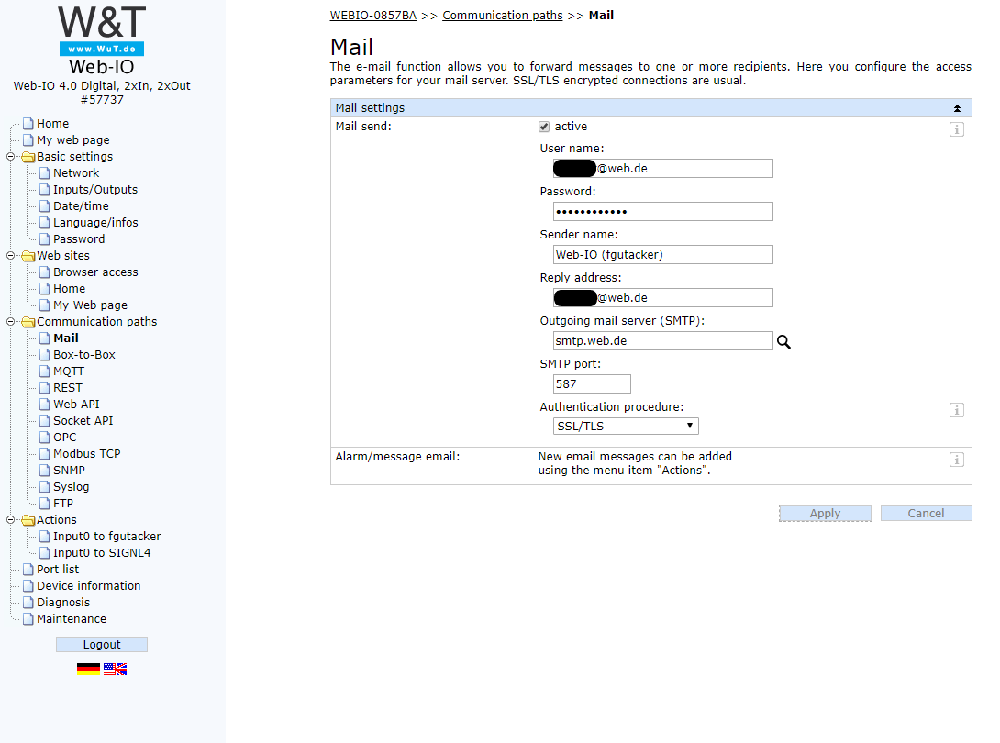
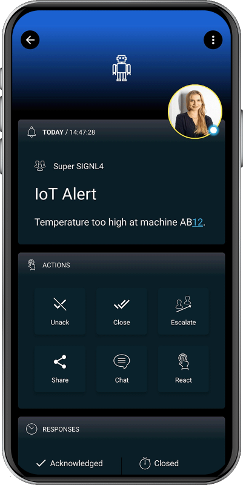

# SIGNL4 Integration with Web-IO from Wiesemann and Theis 

The method we use here for the integration with SIGNL4 is email. It is necessary to enter the data of the SMTP server of SIGNL4 in the configuration of the Web-IO.



After this data has been entered, the email action can be set up. This area is also self-explanatory. You need to enter the email address of your SIGNL4 team (i.e. <team-secret@mail.sign4.com>) in the field "recipient email address".

Subject line and message text can be freely designed. Placeholders are used to mark the places where dynamic values will be entered later.

**Subject line**:  
```
Alert on <dn> at (<$y>-<$m>-<$d> <$h>:<$i>:<$s>)
```

**The message content looks like this**:  
```
System: "Sensor <dn>"
Time: "<$y>-<$m>-<$d> <$h>:<$i>:<$s>"
State: "<i1>"
```

With this formatting of the email, we ensure that SIGNL4 recognizes the individual values as dedicated parameters and visualizes them accordingly in the app as small tiles.

**The placeholders are the following values**:  
```
<i1> = Name of the first input channel
<c1> = Counter status of the first input channel
<dn> = Device name
<$y> = Year
<$m> = month
<$d> = day
<$h> = hour
<$i> = minute
<$s> = second
```

For more information, please refer to the manual of your Web-IO device.

These placeholders are replaced with the appropriate values before the message is sent. Since we used the format "label:value" in the message content, SIGNL4 will be recognizing the values and displaying them in the app.

The alert in SIGNL4 might look like this.


