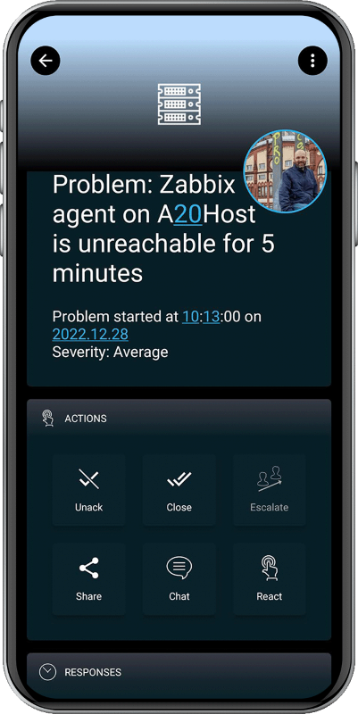

# SIGNL4 Integration with Zabbix

Since Zabbix 5.0 SIGNL4 is an integral part of Zabbix and available as a Media Type for Alerting. SIGNL4 can also be added as Media Type for previous Zabbix versions. The SIGNL4 Media Type allows you to forward problems from Zabbix to a SIGNL4 team.

## Two-Way Integration

With SIGNL4 it is also possible to acknowledge, annotate and close alerts directly from the SIGNL4 app. To forward this information back to Zabbix, you need to configure the Zabbix connector in your SIGNL4 portal under Apps.

With Zabbix 6.4 and higher the authentication method has changed. With SIGNL4 you need to use the Zabbix API Token instead of username and password. You can obtain the Zabbix API token as described [here](https://www.zabbix.com/documentation/current/en/manual/web_interface/frontend_sections/users/api_tokens). Please note that in this case the Apache Web server on Zabbix side needs to pass the Authorization header. If this should not be the case you can check this discussion [here](https://www.zabbix.com/forum/zabbix-troubleshooting-and-problems/465800-python-api-modules-not-working-with-6-4).

For older Zabbix versions SIGNL4 provides a dedicated integration for Zabbix [here](https://www.zabbix.com/integrations/signl4). You can also find the integration scripts on [GitHub](https://github.com/signl4/signl4-integration-zabbix). Just go ahead, download the respective alert scripts from there and follow the instructions on the page.

Here is a video showing this integration:

<iframe width="560" height="315" src="https://www.youtube.com/embed/oryARdRV2es?si=zlcrqfT_6V3XklZG" title="YouTube video player" frameborder="0" allow="accelerometer; autoplay; clipboard-write; encrypted-media; gyroscope; picture-in-picture; web-share" allowfullscreen></iframe>

The alert in SIGNL4 might look like this.

